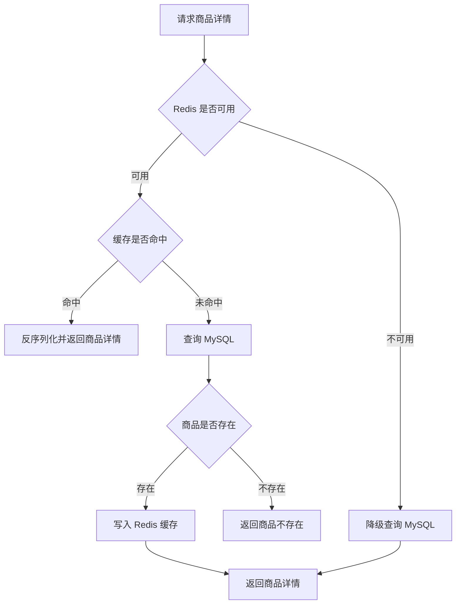

# Redis 缓存与库存预扣设计

本文说明当前项目的 Redis 使用范围、商品详情 cache-aside 查询流程、库存 Lua 预扣、降级策略和后续演进方向。

## 1. 缓存目标

当前项目使用 Redis 做两类增强：

- 商品详情 cache-aside：减少热点商品详情对 MySQL 的重复查询。
- 库存 Lua 预扣：在 MySQL 扣减前做一层可售库存软保护，降低热点库存直接打到数据库的压力。
- 库存对账：周期比对 Redis 可售库存与 MySQL 当前库存，发现差异后记录日志。

Redis 不作为库存事实源。订单、库存流水和最终库存仍以 MySQL 事务结果为准；Redis 不可用或库存 key 缺失时，下单流程降级走 MySQL 行锁和条件扣减。

## 2. 缓存范围

| 接口/数据 | 是否缓存 | 原因 |
| --- | --- | --- |
| 商品详情 | 是 | 读多写少，适合 cache-aside |
| 商品列表 | 否 | 当前列表语义简单，后续可按筛选条件扩展 |
| 库存可售数量 | 是 | 用 Lua 原子预扣做软保护；MySQL 仍是事实源 |
| 订单 | 否 | 订单属于用户私有数据，状态变化频繁，当前直接查 MySQL 更简单可靠 |
| 用户资料 | 否 | 当前访问量低，暂不引入缓存复杂度 |

## 3. 缓存 Key 设计

商品详情缓存 Key：

```text
product:detail:{product_id}
```

示例：

```text
product:detail:1001
```

库存可售 Key：

```text
inventory:{stock}:available:{product_id}
```

订单预扣 reservation Key：

```text
inventory:{stock}:reservation:{order_id}
```

Key 设计原则：

- 语义清晰，能直接看出数据类型和业务 ID。
- 与商品详情一一对应，便于商品状态变化时精准删除。
- 不把用户信息放入商品详情缓存，因为商品详情是公共商品数据。
- 库存预扣相关 key 使用固定 hash tag `{stock}`，确保多商品 Lua 预扣在 Redis Cluster 下不会跨 slot。

## 4. Cache-aside 查询流程



## 5. 缓存失效策略

当前项目在商品状态变化时主动删除商品详情缓存：

- 商品上架：删除 `product:detail:{product_id}`。
- 商品下架：删除 `product:detail:{product_id}`。

这样做的原因：

- 上架/下架会影响商品是否可购买。
- 商品状态变化后，继续使用旧缓存可能导致前端看到错误状态。
- 删除缓存比更新缓存更简单，下一次查询时重新从 MySQL 加载即可。

## 6. Redis 异常降级

当前设计中，Redis 是性能优化，不是主流程依赖。

当 Redis 初始化失败、读取失败或写入失败时：

- 查询商品详情仍然走 MySQL。
- 不因为 Redis 失败导致商品详情接口不可用。
- 主业务链路优先保证正确性和可用性。

这种设计适合求职项目展示，因为它体现了一个重要后端原则：**缓存是加速层，不应该轻易成为核心业务的单点故障。**

## 7. 库存 Lua 预扣

### 7.1 写入时机

- 初始化库存成功后，写入 `inventory:{stock}:available:{product_id}`。
- 手动增加库存成功后，将 Redis 可售库存同步为 MySQL 事务提交后的库存。
- 创建订单时，首次幂等抢占成功后才执行 Redis Lua 预扣；幂等重放不会重复预扣。
- 管理员可调用对账接口，查看 Redis 可售库存与 MySQL 当前库存的差异。
- 管理员可调用重建接口，按 MySQL 当前库存批量重建 Redis 可售库存。
- 后台 worker 默认每 5 分钟自动对账一次，发现差异只记录日志，不自动重建。

### 7.2 预扣流程

Lua 脚本在 Redis 内原子完成：

1. 检查所有商品库存 key 是否存在。
2. 任一 key 缺失时返回 skip，不扣 Redis，继续走 MySQL。
3. 任一商品 Redis 库存不足时返回库存不足，提前拒绝请求。
4. 全部充足时批量 `DECRBY`，并写入 `inventory:{stock}:reservation:{order_id}`。

reservation 记录本订单预扣过的商品和数量，用于后续补偿。

### 7.3 补偿与确认

- MySQL 事务失败：读取 reservation 并回补 Redis，然后删除 reservation。
- 主动取消或超时取消成功：读取 reservation 并回补 Redis，然后删除 reservation。
- 支付成功：删除 reservation，不回补 Redis，因为库存已实际售出。
- Redis 不可用、Lua 执行失败或 reservation 丢失时，不影响 MySQL 主流程。

### 7.4 一致性边界

Redis 预扣是性能保护层，不是库存事实源。即使 Redis 预扣成功，MySQL 事务仍会执行 `SELECT ... FOR UPDATE` 和 `stock_quantity >= quantity` 条件扣减；最终是否创建订单以 MySQL 事务为准。

### 7.5 自动对账

应用启动时会根据 `inventoryReconcile` 配置启动后台对账 worker：

| 配置 | 默认值 | 环境变量 | 说明 |
|---|---|---|---|
| `inventoryReconcile.enabled` | `true` | `INVENTORY_RECONCILE_ENABLED` | 是否启用周期对账 |
| `inventoryReconcile.interval` | `5m` | `INVENTORY_RECONCILE_INTERVAL` | 对账间隔 |
| `inventoryReconcile.timeout` | `3s` | `INVENTORY_RECONCILE_TIMEOUT` | 单次对账超时 |

自动对账只读取 MySQL 和 Redis：

- 无差异：记录 `inventory Redis reconcile finished`。
- 有差异：记录 `inventory Redis reconcile found differences`，包含 `checked_count` 和 `diff_count`。
- 对账失败：记录 `inventory Redis reconcile failed`，不影响 HTTP 服务和下单主流程。

自动对账不会直接重建 Redis。需要修复差异时，由管理员查看差异报告后再手动调用重建接口。

## 8. 当前边界

当前缓存设计是基础版 cache-aside，暂不包含：

- 缓存击穿保护。
- 缓存穿透保护。
- 延迟双删。
- 本地缓存。
- 分布式锁。
- 商品列表缓存。

这些不是当前阶段必须实现的内容。对于本项目来说，优先级应该是：先把事务、幂等、状态机、测试和工程化做清楚，再按需要补充缓存增强策略。

## 9. 后续演进方向

后续可以逐步增加：

1. **缓存 TTL**：为商品详情设置过期时间，避免长期脏数据。
2. **缓存空值**：对不存在商品短时间缓存空结果，降低穿透风险。
3. **互斥重建**：热点 Key 失效时避免大量请求同时打到 MySQL。
4. **商品列表缓存**：按状态、分页和筛选条件生成列表缓存 Key。
5. **缓存指标**：统计命中率、未命中率、Redis 错误次数和预扣命中情况。
6. **结构化日志**：记录缓存命中、未命中、删除、预扣和降级事件。
7. **库存对账告警**：把自动对账差异日志接入告警平台，必要时由管理员触发重建。

## 10. Redis key 变更影响

库存预扣 key 已从早期的 `inventory:available:{product_id}` / `inventory:reservation:{order_id}` 调整为带固定 hash tag 的 `inventory:{stock}:...` 格式。

影响：

- MySQL 表结构不变，不需要数据库迁移。
- Redis 中旧格式库存 key 不会被新代码继续读取。
- 部署新版本后，管理员应调用 Redis 可售库存重建接口，让 Redis 按 MySQL 当前库存重新生成新格式 key。
